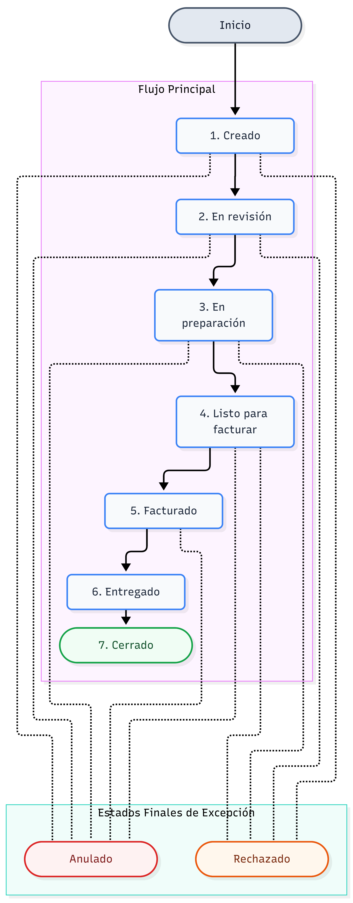
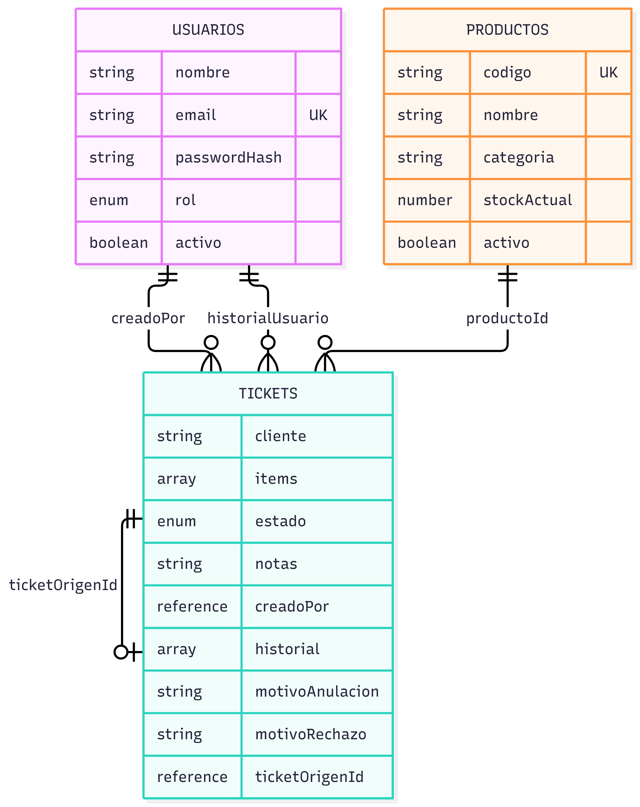

# Majito – Esquema de Base de Datos
**Trabajo Final Integrador – 2.ª entrega**

Base de datos documental (MongoDB). Este documento acompaña al listado de módulos y describe las colecciones que sostienen el sistema, sus campos y sus relaciones.

## 1. Resumen de colecciones

| Colección | Propósito |
|---|---|
| `usuarios` | Personas que operan el sistema, con su rol asignado |
| `productos` | Catálogo de materiales con su stock, migrado desde Tango Gestión |
| `tickets` | Pedidos del circuito completo, con su estado, historial y vínculos |

## 2. Colección `usuarios`

| Campo | Tipo | Descripción |
|---|---|---|
| `nombre` | String | Nombre completo del usuario |
| `email` | String (único) | Usado como identificador de acceso |
| `passwordHash` | String | Contraseña hasheada (bcrypt); nunca se expone en las respuestas de la API |
| `rol` | Enum | `vendedor` \| `administracion` \| `deposito` |
| `activo` | Boolean | Permite deshabilitar un usuario sin borrarlo |

## 3. Colección `productos`

| Campo | Tipo | Descripción |
|---|---|---|
| `codigo` | String (único) | Identificador del producto en Tango Gestión; clave de la migración |
| `nombre` | String | Nombre del material |
| `categoria` | String (opcional) | Agrupación del producto |
| `stockActual` | Number | Cantidad disponible; Majito es la fuente de verdad a partir de la migración inicial |
| `activo` | Boolean | Permite dar de baja un producto sin borrarlo |

## 4. Colección `tickets`

| Campo | Tipo | Descripción |
|---|---|---|
| `cliente` | String | Nombre del cliente que hace el pedido |
| `items` | Array de sub-documentos | Ver detalle abajo |
| `estado` | Enum | Ver flujo de estados en la sección 5 |
| `notas` | String (opcional) | Notas libres (ej. "pago por adelantado") |
| `creadoPor` | ObjectId → `usuarios` | Quién generó el ticket |
| `historial` | Array de sub-documentos | Ver detalle abajo |
| `motivoAnulacion` | String (opcional) | Obligatorio en la práctica cuando `estado = anulado` |
| `motivoRechazo` | String (opcional) | Obligatorio en la práctica cuando `estado = rechazado` |
| `ticketOrigenId` | ObjectId → `tickets` (opcional) | En un ticket de reemplazo, referencia al ticket rechazado que le dio origen |

### 4.1 Sub-documento `items[]`
| Campo | Tipo | Descripción |
|---|---|---|
| `productoId` | ObjectId → `productos` | Producto pedido |
| `cantidad` | Number | Cantidad solicitada |

### 4.2 Sub-documento `historial[]`
| Campo | Tipo | Descripción |
|---|---|---|
| `estado` | Enum | Estado al que cambió el ticket en ese momento |
| `usuario` | ObjectId → `usuarios` | Quién hizo el cambio |
| `fecha` | Date | Cuándo se hizo (automático) |
| `motivo` | String (opcional) | Se completa en anulación y rechazo |

`items` y `historial` se modelan como sub-documentos embebidos (no como colecciones aparte), porque siempre se leen y escriben junto con su ticket — es el patrón recomendado en MongoDB para datos que no tienen sentido de forma independiente.

## 5. Flujo de estados

`creado → en_revision → en_preparacion → listo_para_facturar → facturado → entregado → cerrado`

Dos estados de excepción, disponibles en cualquier punto anterior a `facturado`:
- **`anulado`**: iniciado por el cliente o por decisión interna (arrepentimiento, error de pago). Requiere motivo.
- **`rechazado`**: iniciado por falta de stock o diferencia detectada en depósito. Requiere motivo. El ticket de reemplazo se crea con `ticketOrigenId` apuntando a este.

## 6. Relaciones entre colecciones

- `tickets.creadoPor` → `usuarios` (quién creó el ticket)
- `tickets.historial[].usuario` → `usuarios` (quién hizo cada cambio de estado)
- `tickets.items[].productoId` → `productos` (qué se pidió)
- `tickets.ticketOrigenId` → `tickets` (referencia de un ticket a otro, en caso de rechazo)

No hay una relación inversa explícita en el modelo (por ejemplo, `productos` no guarda una lista de los tickets que lo referencian) — se consulta desde el lado de `tickets`, que es el que necesita esa información en la práctica.
