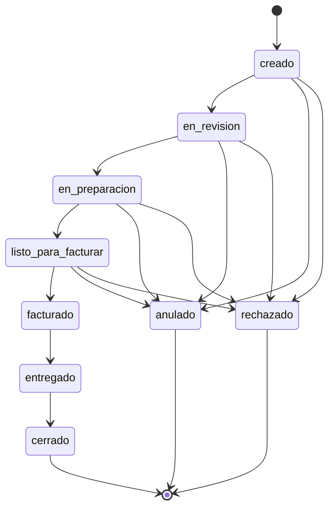
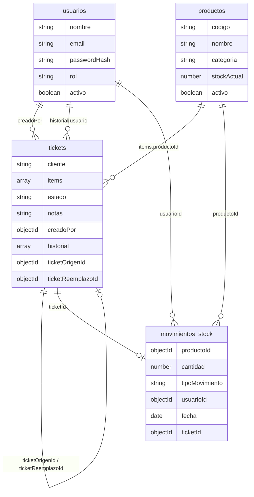

# Majito – Esquema de Base de Datos
**Trabajo Final Integrador – 2.ª entrega**

Base de datos documental (MongoDB). Este documento acompaña al listado de módulos y describe las colecciones que sostienen el sistema, sus campos y sus relaciones.

Nota general: las colecciones `usuarios`, `productos` y `tickets` incluyen automáticamente los campos `createdAt` y `updatedAt` (timestamps de creación y última modificación), generados por Mongoose y no listados campo por campo en las tablas de abajo por ser un comportamiento estándar de todas las colecciones.

## 1. Resumen de colecciones

| Colección | Propósito |
|---|---|
| `usuarios` | Personas que operan el sistema, con su rol asignado |
| `productos` | Catálogo de materiales con su stock, migrado desde Tango Gestión |
| `tickets` | Pedidos del circuito completo, con su estado, historial y vínculos |
| `movimientos_stock` | Auditoría de cada cambio de stock: qué se movió, cuánto, por qué y quién |

## 2. Colección `usuarios`

| Campo | Tipo | Descripción |
|---|---|---|
| `nombre` | String | Nombre completo del usuario |
| `email` | String (único) | Usado como identificador de acceso |
| `passwordHash` | String | Contraseña hasheada (bcrypt); nunca se expone en las respuestas de la API |
| `rol` | Enum | `vendedor` \| `administracion` \| `deposito` |
| `activo` | Boolean | Permite inactivar un usuario sin borrarlo, preservando la integridad del historial de tickets que lo referencian |

## 3. Colección `productos`

| Campo | Tipo | Descripción |
|---|---|---|
| `codigo` | String (único) | Identificador del producto en Tango Gestión; clave de la migración |
| `nombre` | String | Nombre del material |
| `categoria` | String (opcional) | Agrupación del producto |
| `precio` | Number (mínimo 0) | Precio de catálogo del producto. Es fijo y único por producto (no varía por ticket); solo Administración puede definirlo o modificarlo |
| `stockActual` | Number (mínimo 0) | Cantidad disponible; Majito es la fuente de verdad a partir de la migración inicial. El esquema valida explícitamente que no pueda quedar en negativo |
| `activo` | Boolean | Permite dar de baja un producto sin borrarlo |

## 4. Colección `tickets`

| Campo | Tipo | Descripción |
|---|---|---|
| `cliente` | String | Nombre del cliente que hace el pedido |
| `items` | Array de sub-documentos | Ver detalle en 4.1 |
| `estado` | Enum | Ver flujo de estados en la sección 6 |
| `notas` | String (opcional) | Notas libres (ej. "pago por adelantado") |
| `creadoPor` | ObjectId → `usuarios` | Quién generó el ticket |
| `historial` | Array de sub-documentos | Ver detalle en 4.2 |
| `motivoAnulacion` | String (opcional) | Obligatorio en la práctica cuando `estado = anulado` |
| `motivoRechazo` | String (opcional) | Obligatorio en la práctica cuando `estado = rechazado` |
| `ticketOrigenId` | ObjectId → `tickets` (opcional) | En un ticket de reemplazo, referencia al ticket rechazado que le dio origen |
| `ticketReemplazoId` | ObjectId → `tickets` (opcional) | En un ticket rechazado, referencia al ticket de reemplazo creado a partir de él (relación bidireccional con `ticketOrigenId`) |

### 4.1 Sub-documento `items[]`
| Campo | Tipo | Descripción |
|---|---|---|
| `productoId` | ObjectId → `productos` | Producto pedido |
| `productoNombre` | String | Snapshot del nombre del producto al momento de crear el ticket, para que el histórico no dependa de cambios posteriores en el catálogo |
| `productoCodigo` | String | Snapshot del código del producto, mismo motivo que arriba |
| `cantidad` | Number | Cantidad solicitada |

### 4.2 Sub-documento `historial[]`
| Campo | Tipo | Descripción |
|---|---|---|
| `estado` | Enum | Estado al que cambió el ticket en ese momento |
| `usuario` | ObjectId → `usuarios` | Quién hizo el cambio |
| `fecha` | Date | Cuándo se hizo (automático) |
| `motivo` | String (opcional) | Se completa en anulación y rechazo |

`items` y `historial` se modelan como sub-documentos embebidos (no como colecciones aparte), porque siempre se leen y escriben junto con su ticket — es el patrón recomendado en MongoDB para datos que no tienen sentido de forma independiente.

## 5. Colección `movimientos_stock`

Registra cada cambio en el stock de un producto, para poder auditar quién lo modificó, cuándo y por qué.

| Campo | Tipo | Descripción |
|---|---|---|
| `productoId` | ObjectId → `productos` | Producto afectado |
| `cantidad` | Number | Cantidad del movimiento (positiva o negativa según el tipo) |
| `tipoMovimiento` | Enum | `migracion_inicial` \| `descuento_facturacion` \| `ajuste_manual` |
| `usuarioId` | ObjectId → `usuarios` | Quién generó el movimiento |
| `fecha` | Date | Cuándo ocurrió (automático) |
| `ticketId` | ObjectId → `tickets` (opcional) | Solo se completa cuando `tipoMovimiento = descuento_facturacion`, vinculando el movimiento al ticket que lo originó |

## 6. Flujo de estados

```mermaid
stateDiagram-v2
    [*] --> creado
    creado --> en_revision
    en_revision --> en_preparacion
    en_preparacion --> listo_para_facturar
    listo_para_facturar --> facturado
    facturado --> entregado
    entregado --> cerrado
    cerrado --> [*]

    creado --> anulado
    en_revision --> anulado
    en_preparacion --> anulado
    listo_para_facturar --> anulado
    anulado --> [*]

    creado --> rechazado
    en_revision --> rechazado
    en_preparacion --> rechazado
    listo_para_facturar --> rechazado
    rechazado --> [*]
```

Dos estados de excepción:
- **`anulado`**: disponible desde cualquier estado anterior a `facturado`. Iniciado por el cliente o por decisión interna (arrepentimiento, error de pago). Requiere motivo.
- **`rechazado`**: disponible desde cualquier estado anterior a `facturado`. Iniciado por falta de stock o diferencia detectada en depósito. Requiere motivo. El ticket de reemplazo se crea con `ticketOringId` apuntando a este, y este a su vez queda con `ticketReemplazoId` apuntando al nuevo.

## 7. Relaciones entre colecciones

```mermaid
erDiagram
    usuarios ||--o{ tickets : "creadoPor"
    usuarios ||--o{ tickets : "historial.usuario"
    productos ||--o{ tickets : "items.productoId"
    tickets ||--o| tickets : "ticketOrigenId / ticketReemplazoId"
    productos ||--o{ movimientos_stock : "productoId"
    usuarios ||--o{ movimientos_stock : "usuarioId"
    tickets ||--o| movimientos_stock : "ticketId"

    usuarios {
        string nombre
        string email
        string passwordHash
        string rol
        boolean activo
    }
    productos {
        string codigo
        string nombre
        string categoria
        number stockActual
        boolean activo
    }
    tickets {
        string cliente
        array items
        string estado
        string notas
        objectId creadoPor
        array historial
        objectId ticketOrigenId
        objectId ticketReemplazoId
    }
    movimientos_stock {
        objectId productoId
        number cantidad
        string tipoMovimiento
        objectId usuarioId
        date fecha
        objectId ticketId
    }
```

Todas las relaciones son referencias (ObjectId), no joins ni claves foráneas impuestas por la base — la integridad la garantiza la aplicación, no MongoDB.